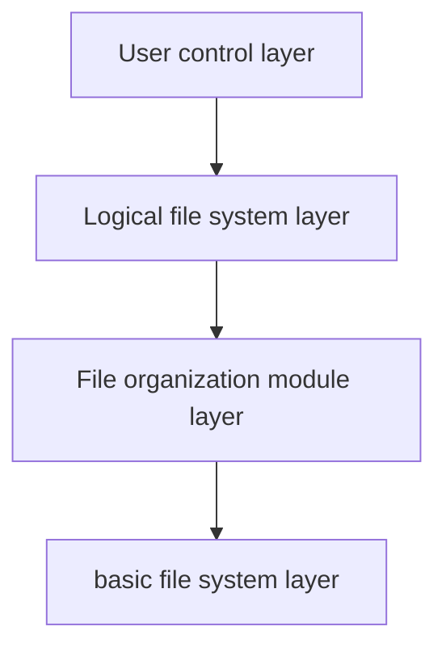

# Operating system design
In computing, a file system (or filesystem) is used to control how data is stored and retrieved. Without a file system, information placed in a storage area would be one large body of data with no way to tell where one piece of information stops and the next begins. By separating the data into pieces and giving each piece a name, the information is easily isolated and identified.[^1]

In this project, the requirement is to implement a unix-like file system by c++. 
To break a system into small parts, I designed and implemented the file system layer by layer. 

- The bottom layer (we can call it basic file system layer) of my file system is to read and write from desk by specifying the position on the disk.
- Then comes the **File organization module layer** understands files, logical address, and physical blocks. This layer can
	-   Translates logical block to physical block
	-   Manages free space, disk allocation
- Then **logical file system layer:** 
	- manages metadata and perform tasks specified by user layer 
	- gets file name and command provided by the user and connect to file organization layer by providing logic block number. 
	- also performed security check to protect our file system from malice operation.
- Finally we end up with user control layer, I implemented a simple cmd to interact with people.



The crux of the requirement is the implementation of designing organization structure and perform logic file system operation. In this report, each layer will be elaborated from design to implementation. Then comes problems encountered when programming, end up with conclusion.


## File organization module
Our file system contains a bunch of metadata, including, super block, inode and datablock. The design and implement of each of them will be detailed in this section.

After designing the data structure, I implemented a function to finish the task of managing each blocks, including using Free Inode Buffer to provide logical file layer free inode number efficiently, block number checking to ensure system consistency, etc.   
When talking about the total number of blocks, The file system should occupy 16 MB in total, divided by 1 KB, we have 16 KB (16000) blocks.
### Address structure
In this section, the structure of each module will be introduced and the function to manage them will be elaborated in next section.
#### Super block structure

Super block is a segment of metadata describing the file system on a block device. Each super block struct is 17916 bytes. The block records information about our file system, including information necessary to mount a file system.  
Also, the information stored in the super block will be exploited by different
functions.  


| name                | type           | commit                                                                                                                                        |
| ------------------- | -------------- | --------------------------------------------------------------------------------------------------------------------------------------------- |
| magic               | int            | When the filesystem is mounted, the OS looks for this magic number. If it is correct, then the disk is assumed to contain a valid filesystem. |
| free_inode_buff     | unsigned short | an array of free inodes                                                                                                                       |
| free_inode_pointer  | int            | where to search for next free inodes                                                                                                          |
| free_inode_buff_num | int            | free inodes buffer size                                                                                                                       |
| block_bitmap        | bool array     | a bitmap used to store block usage info                                                                                                       |
| inode_bitmap        | bool array     | a bitmap used to store inodes usage info                                                                                                      |                                                                                                                          |


#### Inode structure

When we store our information in a file, and the file system stores the information about a file in an inode (sometimes called as an inode number).

Each inode (no matter whatever it stores data or directory) should contain certain information, and the most obvious one should be the inode type to identify whether this inode is used to store files or directory. Other attributes are also indispensable, such as inode_num_link  to identify whether this inode is occupied. If the link hits 0, the inode can be allocated to new files. In addition, attribute link create time should also be provided to facilitate the operating system to perform other tasks.

##### The inode structure of a directory 
- The **directory entry** is just a struct of inode and filename — just enough information to translate from a filename to an inode and get to the actual file. and it contains filename/folder names and Inode number.
	```
	filename1 :> inode1
	filename2 :> inode2
	....
	```
	Then we can just follow the inode number to find more information about the file.
- The directory inode should also contain the information of the **size of the directory** to identify whether the directory is empty or not. 

##### The inode structure of a file
This kind of inode is used to store file information. It can be divided into metadata and block pointer 2 parts.  
- **File metadata** part should contain file size, owner info and other things to help identify the inode.  
- The **block pointer** should end up with pointing to data blocks. 
	- There are two kinds of pointers, direct pointer and indirect pointer. Each inode has 10 direct pointers and 1 indirect pointer. The difference is that direct pointer store the block number directly and indirect pointer store block number whose content is address to data block.

##### place of inode

After deciding to use inode in this project, the next question is where should we place our inode? Definitely we can create an inode when create a file, and jettison them into disk without discrimination. So we can avoid pre-arrange inode for our file system. At first I did so, however, I realized that the size of an inode is much smaller than a block, and the size is fixed that means we can pre-arrange the inode to spare a lot of space. So I decided to compartmentalize my block to provide a special size to store inodes.

##### Number of inode

There is a trade-off between block number and inode number. The more inodes, the
fewer data blocks. After referring to resources, I decided to allocate 10% of
total blocks as inode block. Each inode is 552 bytes, so there are around 2500
inodes (less than theory number which enables us to add extra fields in the
inodes). We can also allocate new block in free space after all this inodes are used.


##### Implementation of inode
Follows is the inode structure in the project. This inode can be used as 2 kinds of inodes, which are file inode and directory inode, and what kind of inode it in on earth can be deducted from inode_type field. The inode is implemented by struct in c++ too.


| variable           | explanation                                                        |
| ------------------ | ------------------------------------------------------------------ |
| inode_type         | an integer to decide whether it is file inode or directory inode   |
| inode_num_link     | how many files are linked to this inode                            |
| dir_items          | store directory entry, or dentry which contains name and inode num |
| dir_size           | the size of directory                                              |
| file_size          | the size of file                                                   |
| create_time        | the time this inode is created                                     |
| inode_add          | a pointer point to data block                                      |
| inode_indirect_add | a pointer point to indirect data block which points to data block                                                                    |

#### Block structure
The easiest way to manage block is by contiguous allocation. we allocate everything in sequence, however, this will cause finding space for file, knowing file size and external fragmentation. So we use inode to manage the block.
The block is stored in a 2-D array in c++ in this project, the first dimension is the block number and the second dimension controls offset.   
Theoretically, the size of free space should equal to total block number minus the sum of block used to store super block and inodes. However, I design reserve some "real" free block for future use. Hence the free block number is 14400.  
Finally, the number of available free block number and the utilization can be informed by querying superblock


### Function to organize address structure
#### Inode management
The free space is stored in a bitmap which 0 stands for free and 1 stands for busy. I choose to use bit map to manage my free block versus linked list is because when implemented by linked list, it will waste a lot of space, and we cannot get contiguous space easily. Free inode management by Bitblock with buffer is both time efficient and space efficient. 
- In detail, we designed **a inode buffer with a pointer** to store free inode to avoid iterating through inode_map each time when we are required to allocate a free block.
	- fill_in_inode_buf: fill in inode buffer from the position of the pointer
	- get_free_inode_num: integrity checking function, used to check and update inode number
	- the work flow of free inode buffer:
		- The inode buffer will be filled from lower address to higher address at first
		- When an inode is required, one inode will get out of the free inode buffer.
		- When the inode buffer is empty, fill the buffer from the buffer pointer's position
		- When an inode is released, if the pointer is bigger than the released inode, we change the position of the pointer to this position. So that next time, we can make sure all inode before this address is occupied so only all address after or on this address can be candidates for free block.

- Initialize_file_inode & initialize_dir_inode: initialize an inode by providing default information.

- get_inode: 
	- input: absolute or relative path 
	- output: the inode corresponding to the given path.
	- The workflow
		- 1. Makes sure the directory is absolute path
		- 2. Finds the inode of the root directory, then use the info stored in dentry to find the inode of the nested directory
		- 3. returns inode number when reaching terminal.


- Get_parent_inode
	- input: absolute or relative path 
	- output: the parent inode corresponding to the given path.
	- Workflow: 
		- 1. translate path into absolute path
		- 2. parse absolute path according to /
		- 3. return to directory before last /


#### Block management
- update_rest_blocks:
	- Iterate through block map to count free block. As we have store free block number already, periodically use this function can improve the consistency of our file system.
- Update_rest_blocks:
	- calculate how many blocks will be occupied by a file by the parameter of file size.


## Logic file system module
After finishing the file organization module, we can use the structures and functions provided by that module to handle the command from the user module, this module provides the functional function and utility function as follows:  
(utility function is kind of function that designed to help functional function to work)

### path management

| name               | type                | comment                                                             |
| ------------------ | ------------------- | ------------------------------------------------------------------- |
| include_itself     | utility function    | test whether the path include it self                               |
| split_pathname     | utility function    | split the absolute path name to get the path name and file name     |
| get_full_path_name | utility function    | input a path name and file name, combine it into absolute path name |
| changeDir          | functional function | change current path                                                 |

I provide three kinds of utility function to manage the path, they can convert between absolute path name and relative path name, extract file name, and test whether the path includes itself.
When implementing split_path name, I mastered how to return multiple values in c++ with std::tuple and mimic stack with the vector container. Got better understanding of c++ std library.  
I also classify change Dir as path management group as this function's main functionality is manipulate path and do security check.

code snippet for split pathname:

```c++
std::tuple<std::string, std::string> split_pathname(char p_path[280])
{
    char* fpath = strtok(p_path, "/");//this function will change p_path too
    vector<string> tmp_v;
    while (fpath != NULL) {
        tmp_v.push_back("/");
        tmp_v.push_back(fpath);
        fpath = strtok(NULL, "/");
    }
    //get parent directory
    std::vector<string> parent_dir_v(tmp_v.begin(), tmp_v.end() - 1);
    std::vector<string> dir_name_v(tmp_v.end() - 1, tmp_v.end());
    std::string ret_parent_dir_s = accumulate(begin(parent_dir_v), end(parent_dir_v), std::string{});
    std::string ret_dir_name_s = accumulate(begin(dir_name_v), end(dir_name_v), std::string{});
```


### cp function


| name                | type                | comment                                                                         |
| ------------------- | ------------------- | ------------------------------------------------------------------------------- |
| cputil_secu_check_s | utility function    | security check for copy                                                         |
| cputil_secu_check_d | utility function    | security check for copy                                                         |
| deep_cp             | functional function | create a new file and cp into it                                                |
| shallow_cp          | functional function | do not create a new file, just let the directory entry point to same inode only |
|                     |                     |                                                                                 |


First two functions are used to perform security check.
- Deep_cp:
	- If we modify the destination file after deep copy, the source file will not be modified 
	- create a new file then iterate through source file to fill the created blank file
- Shallow_cp:
	- After shallow copy, the source file and dest file point to the same inode.
	- After security checking, create a directory entry in current directory which points to destination file, then increase the inode_link_num.

code snippet for deep copy:
```c++
if (use_block == num_block) {
	break;
}
if (use_block < 10) {
	myfs->inode[dest_inode].inode_addr[use_block] = k;
	myfs->sb.block_bitmap[k] = true;
	memcpy(myfs->free_space[k], myfs->free_space[myfs->inode[source_inode_id].inode_addr[use_block]], BLOCK_SIZE);
	myfs->inode[dest_inode].file_size++;
}
else if (use_block == 10) {
	//be concise about inode_size:
	myfs->inode[dest_inode].inode_indirect_addr = k;
	myfs->sb.block_bitmap[k] = true;
}
else {
	myfs->sb.block_bitmap[k] = true;
	char tmp[2];
	unsigned short pos = k ;//consise position
	memcpy(tmp, &pos, 2);

	//allocate block k to dest's indirect block
	unsigned short block_num = myfs->inode[dest_inode].inode_indirect_addr;
	int offset = (use_block - 11)*2;
	myfs->free_space[block_num][offset+0] = tmp[0];
	myfs->free_space[block_num][offset+1] = tmp[1];

	//get block number from source block
	unsigned short s_block_num = myfs->inode[source_inode_id].inode_indirect_addr;
	unsigned short block_addr;
	char tp[2];
	tp[0] = myfs->free_space[s_block_num][offset+0];
	tp[1] = myfs->free_space[s_block_num][offset+1];
	//copy data from source to current block
	memcpy(&block_addr, tp, 2);
	memcpy(myfs->free_space + k, myfs->free_space + block_addr, BLOCK_SIZE);
	myfs->inode[dest_inode].file_size++;
}
```

code snippet for shallow copy
```c++
for (int j = 0; j < DIR_SIZE; j++) {
	if (strlen(myfs->inode[dst_parent_inode_num].dir_items[j].item_name) == 0) {
		memcpy(myfs->inode[dst_parent_inode_num].dir_items[j].item_name, pname_2, 28);
		myfs->inode[dst_parent_inode_num].dir_items[j].item_inode_id = source_inode_num;
		myfs->inode[source_inode_num].inode_num_link++;
		break;
	}
```


### Directory management
| name      | type                | comment                                                              |
| --------- | ------------------- | -------------------------------------------------------------------- |
| deleteDir | functional function | delete a directory (including the files and directories it contains) |
| createDir | functional function | create an empty directory                                            | 
| dir       | functional function | list the directories in current directory                            |

When deal with directory, one difference between directory and file is that files can not contain other files. Which means that we can only focus on the file itself. However, It is not the case when create and delete directory. So, there are a lot of recursive operations when we are facing the directory management.

- dir
	- list all the directories by iterating through current directory entries.
- createDir
	- Nested-directory creation is supported.
	- After security check, allocate a new inode by asking inode buffer to the directory to be created, then update parent directory entry.
	- If the target directory's parent directory is not created yet, we have to create the parent directory first, then create the target directory.
- deleteDir
	- Nested-directory deletion is supported.
	- After security check (whether the target directory contains current directory), first check whether this directory is empty. 
	- If current directory is not empty, we have to iterate through all the items in the directory, and delete by calling deleteFile or deleteDir **recursively** until the target directory is empty.
	- Then delete target directory
	- Last we update information in parent directory.

Code snippet for recursive creation:
```c++
    //check whether parent directory has exist
    int inode_id = get_inode((char*)parent_dir_s.c_str());
    if (inode_id == -1) {
        cout << "parent path not found, creating..." << endl;
        //create parent path
        createDir((char*)' ', (char*)parent_dir_s.c_str());
        inode_id = get_inode((char*)parent_dir_s.c_str());
    }
```

Code snippet for recursive deletion(inside function deleteDir) :
```c++
for (int i = 0; i < DIR_SIZE; i++) {
	int tmp_id = myfs->inode[inode_id].dir_items[i].item_inode_id;
	if (tmp_id) {
		//use tmp to make sure not affect p_path
		char tmp[MAX_NAME_SIZE * MAX_DIR_DEPTH] = "";
		strcpy(tmp, p_path);
		char * new_p_name = strcat(tmp, "/");
		new_p_name = strcat(new_p_name, myfs->inode[inode_id].dir_items[i].item_name);
		if (myfs->inode[tmp_id].inode_type == DIR_TYPE) {
			deleteDir((char*) " ",new_p_name);
		}
		else {
			deleteFile((char*)" ", new_p_name);
		}
	}
}
```


### File management 
| name       | type                | comment                                   |
| ---------- | ------------------- | ---------------------------------- |
| cat        | functional function | display a file                     |
| deleteFile | functional function | delete a file                      |
| createFile | functional function | create a file in current directory |

When it comes to file management, the creation process and deletion process is similar to directory management. However, the main difficulty incurred due to file management is address pointer and indirect block. Each of the function above have to deal with this issue. So, considering that the inode allocation and release procedure has been discussed in the directory management part, I will not explain in detail here. In this section, I will introduce how I manage the address pointer and indirect block mainly.

Above are the main procedure to handle the indirect address:
1. When creating a file, we have to calculate how many blocks are required. 
2. Then, if the required block can be satisfied by indirect pointers, we simply set indirect pointer to the allocated block number.
3. If the size is bigger than the direct size, we have to allocate a new block to store indirect pointers.
4. Then we allocate more blocks, and store the block information in the indirect address block.

Code snippet for indirect block :
```c++
if (!myfs->sb.block_bitmap[k]) {
	if (use_block == num_block) {
		break;
	}
	if (use_block < 10) {
		myfs->inode[dest_inode].inode_addr[use_block] = k;
		myfs->sb.block_bitmap[k] = true;
		memcpy(myfs->free_space[k], myfs->free_space[myfs->inode[source_inode_id].inode_addr[use_block]], BLOCK_SIZE);
		myfs->inode[dest_inode].file_size++;
	}
	else if (use_block == 10) {
		//be concise about inode_size:
		myfs->inode[dest_inode].inode_indirect_addr = k;
		myfs->sb.block_bitmap[k] = true;
	}
	else {
		myfs->sb.block_bitmap[k] = true;
		char tmp[2];
		unsigned short pos = k ;//consise position
		memcpy(tmp, &pos, 2);

		//allocate block k to dest's indirect block
		unsigned short block_num = myfs->inode[dest_inode].inode_indirect_addr;
		int offset = (use_block - 11)*2;
		myfs->free_space[block_num][offset+0] = tmp[0];
		myfs->free_space[block_num][offset+1] = tmp[1];

		//get block number from source block
		unsigned short s_block_num = myfs->inode[source_inode_id].inode_indirect_addr;
		unsigned short block_addr;
		char tp[2];
		tp[0] = myfs->free_space[s_block_num][offset+0];
		tp[1] = myfs->free_space[s_block_num][offset+1];
		//copy data from source to current block
		memcpy(&block_addr, tp, 2);
		memcpy(myfs->free_space + k, myfs->free_space + block_addr, BLOCK_SIZE);
		myfs->inode[dest_inode].file_size++;
	}
	use_block++;
}
```


### Display usage of storage space

| name | type                | comment                           |
| ---- | ------------------- | --------------------------------- |
| sum  | functional function | display the block usage condition |

Dump block usage information to the console.


## User module
I implemented a function called cmd, this function will receive the command from command line and call corresponding function. If the command is not matched, it will warn and give you another chance.


## Lessons learned
When finishing the project, I got familiar with c++ and OOP. I used to program with python heavily, however, python is not suitable for this task (memory management and so on). So In this process I got better understanding of c++, such as pointers, pass by reference, how struct store in memory etc. However, there may still be some deficiency in my project, still have to improve my self.

### Type and object
At first, I want to provide default value by "=" operator directly. However, the compiler complained. Then I look for some information to overcome this problem. Finally, I understand that structure is a _data type_. We can not give values to a data type. We have to give values to instances/objects of data types.  So we can not initialize by specify value at definition.
Finally, I knew that we can implement the function of setting default by providing default object as constructor.

### Memory operation
when implementing indirect address, There was a bug that although I deleted the file created, the resources will not be released. At first, I can not find what's going wrong. Then I delve into the running process and monitor the memory in deleteFile. Finally, I found that It's because I messed up with the offset, so subsequent writing on disk will overwrite the previous one. Which cause that we can not find the right block when deleting.  

### Conditional break point
There was also a bug that when cating a file, there always been memory overwritten. However, This overwritten always happens at the last turn in for loop. So I set up a conditional break point and found that that's because I messed up with the block size the file size, when an indirect block is exploited, the block size always be one more than the file size.

As a result, I mastered how to view memory byte by byte, how to set up break point with condition in Visual Studio. Hone the debug ability.


## Conclusion
I spent around 1 month in this project due to the lack of knowledge of c++. Although design a file system is not difficult for me, the implementation details always annoy me. When things works, every effort worth.  
We have to design the structure of the project beforehand, so that we will have a clear mind when implementation. Design by layer is a common choice, Layering useful for reducing complexity and redundancy, but adds overhead and can decrease performance.  
In this project, I implemented what we have learned in operating system into practice. Also have a deeper understanding of the file system. However, the content of operating system is astronomical, we still have a lot to learn. 
[^1]: https://en.wikipedia.org/wiki/File_system